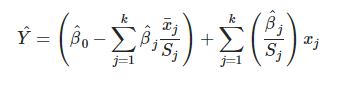

```{r setup,include=FALSE}

knitr::opts_chunk$set(echo = TRUE, warning = FALSE, message = FALSE)

```

# QUESTION 9.1
**Using the same crime data set uscrime.txt as in Question 8.2, apply Principal Component Analysis and then create a regression model using the first few principal components. Specify your new model in terms of the original variables (not the principal components), and compare its quality to that of your solution to Question 8.2. You can use the R function prcomp for PCA. (Note that to first scale the data, you can include scale. = TRUE to scale as part of the PCA function. Don’t forget that, to make a prediction for the new city, you’ll need to unscale the coefficients (i.e., do the scaling calculation in reverse)!)**

**The factor values we used in Q8.2 to predict the Crime value are below for reference**

* M = 14.0
* So = 0
* Ed = 10.0
* Po1 = 12.0
* Po2 = 15.5
* LF = 0.640
* M.F = 94.0
* Pop = 150
* NW = 1.1
* U1 = 0.120
* U2 = 3.6
* Wealth = 3200
* Ineq = 20.1
* Prob = 0.04
* Time = 39.0

Before jumping into the solution, I wrote down the steps needed to get to the solution. This help us track our solution as we go through it. Disclaimer: I got to these steps based on several discussions that happened in Piazza posts this week. 

1. Perform PCA on scaled data. PCA R function prcomp does it all (necessary axis transformations to maximize the variance in the data explained by the least amount of principal components). It also has a parameter to scale the data which is an important step of the process.  
2. Identify the PCs using the plot.
3. Build the regression model using the first few principle components (PCs). This will give us the regression coefficients based on PCs for scaled data. 
4. Perform trace back steps (i.e. unscale) to get the coefficients of the linear model back in terms of the original predictors.  
5. Perform prediction using the unscaled coefficients from the model based on PCs. 
6. Compare the prediction from step 5 to the prediction from Q8.2 which did not use PCA.

First, I loaded the data.

```{r load data}
#setting the seed so that results are the same at every run
set.seed(101) 

#loading data
crimedata <- read.delim("data_9.1/uscrime.txt")

#quick glance at the data
head(crimedata)

```

I built a dataframe of the provided predictors in Q8.2 to use for prediction later on.

```{r predict data}

#data frame with data we need to predict crime for
predictdata <-data.frame(M = 14.0,So = 0, Ed = 10.0, Po1 = 12.0, Po2 = 15.5,LF = 0.640, M.F = 94.0, Pop = 150, NW = 1.1, U1 = 0.120, U2 = 3.6, Wealth = 3200, Ineq = 20.1, Prob = 0.040,Time = 39.0)

```

Before I jumped into models, I checked the pearson correlation matrix of the Crimes data. Value is 1 and -1 indicate positive and negative correlation where 0 indicates no correlation. This will help her see if the factors have any correlation b/w themselves. As we know, PCA helps with:

* Remove correlation
* Reduce the number of factors by factor extraction

We can see from the visual that several factors have very strong positive or negative correlation (e.g. Ineq/Wealth and Ineq/Eq have neg correlation whereas Po1/Po2 have high positive correlation).  

```{r pearson correlation matrix}

library(corrplot) #for correlation plot

#pearson correlation matrix 
corrmat <- cor(crimedata)
round(corrmat, 2)

#plotting the correlation matrix
corrplot(corrmat, type = "upper", order = "hclust", 
         tl.col = "black", tl.srt = 45)

```

**Step 1 & 2 - Perform PCA & Identify PCs**

I performed the PCA on the scaled crime data below and plotted the variation measure of each PC in a bar graph. Variaton measure of a PC is Sum of Sqaured Distances of data point projection on the PC dimension from the center divided by the n-1 where n is the number of records. It essentially described how much a PC represents the variation in the data. 

The plots clearly showed the 1st 4 PCs covered ~80% of the data variation. And 1st 5 PCs covered ~89% of the variation. 4 of 5 PCs would be good to use in the regression model moving forward.

```{r PCA}

pca_crime <- prcomp(crimedata[,1:15], scale. = TRUE)
pca_crime_sum <- summary(pca_crime)
pca_crime_sum

#plot of the proportion of variance of each PC
barplot((pca_crime_sum$importance[2,])*100, 
        main="Variation Distribution Across PCs", 
        xlab="PCs")

#plot of cumulative sum of variance
plot(pca_crime_sum$importance[3,]*100, 
     xlab = "PC", 
     ylab = "Cumulative Proportion of Variance",
     ylim = c(0,100), 
     type = "b")


```

**Step 3 - Build Regression Model Using Principle Components**

I built two models, first with 4 PCs and then with 5. First, I had to bind together the PCs with the Crime Rate column to build the dataset to be used. I did not scale the crime rate column b/c we are trying to predict those values, scaling it would affect our prediction. 

```{r principle component regression}

#binding together the 1st 4 PCs with the crime rate column. 
PC_crime_data4 <- as.data.frame(cbind(pca_crime$x[,1:4], crimedata[,16]))

#4 PCs regression model
four_PC_model <- lm(V5~., data = PC_crime_data4)
summary(four_PC_model)

#binding together the 1st 5 PCs with the crime rate column. 
PC_crime_data5 <- as.data.frame(cbind(pca_crime$x[,1:5], crimedata[,16]))

#5 PCs regression model
five_PC_model <- lm(V6~., data = PC_crime_data5)
summary(five_PC_model)

```

**Step 4 - Get coefficients in terms of the original predictors.**

This step involved,

* First getting the coefficients for the PCA regression (intercept and 4 PC coefficients)
* Next, these coefficients were transformed to orginal 15 variables by matrix multiplication with the rotation matrixfrom the PCA output
* Lastly, these coefficients had to be unscaled so that these could be used for prediction. Unscaling was explained in this link (https://stats.stackexchange.com/questions/74622/converting-standardized-betas-back-to-original-variables). The formula shown below told me that following two formulas could be used to unscale the coefficients:

1. Original Coefficients = Scaled Coefficients / Standard Deviation
2. Original Intercept = Scaled Intercept - (Scaled Coefficients X Mean / Standard Deviation)



```{r coefficients for 4 PC model}

#PCA coefficients from 4 PC regression model
four_intercept <- four_PC_model$coefficients[1]
four_coef <- four_PC_model$coefficients[2:5]

four_intercept
four_coef

#transforming coefficents for the original SCALED variables
four_coef_all <- pca_crime$rotation[,1:4] %*% four_coef
four_coef_all

#Unscaling the coefficients
four_orig_coef <- four_coef_all/sapply(crimedata[,1:15],sd)
four_orig_intercept <- four_intercept - sum(four_coef_all*sapply(crimedata[,1:15],mean)/sapply(crimedata[,1:15],sd))

four_orig_intercept
four_orig_coef

```

```{r coefficients for 5 PC model}

#PCA coefficients from 5 PC regression model
five_intercept <- five_PC_model$coefficients[1]
five_coef <- five_PC_model$coefficients[2:6]

five_intercept
five_coef

#transforming coefficents for the original SCALED variables
five_coef_all <- pca_crime$rotation[,1:5] %*% five_coef
five_coef_all

#Unscaling the coefficients
five_orig_coef <- five_coef_all/sapply(crimedata[,1:15],sd)
five_orig_intercept <- five_intercept - sum(five_coef_all*sapply(crimedata[,1:15],mean)/sapply(crimedata[,1:15],sd))

five_orig_intercept
five_orig_coef

```

**Step 5 - Prediction Crime for the new city using variable values from Q8.2 based on PCA Model**

In this step, I used the coefficients from the 4 and 5 PCA models to make predictions using the variable values we were given in Q8.2 last week. 4 PCA model predicts crime rateof 1113 whereas 5 PCA model predicts 1289. Both values are plausible when we look at the summary of the crime field in the data which has min of 342, max of 1993 and mean of 905. The predicted values are close to the 3rd quartile. 

```{r prediction}

#prediction for 4 PCA Model
four_prediction <- four_orig_intercept + sum(data.frame(mapply('*',predictdata,four_orig_coef)))
four_prediction

#prediction for 5 PCA Model
five_prediction <- five_orig_intercept + sum(data.frame(mapply('*',predictdata,five_orig_coef)))
five_prediction

summary(crimedata$Crime)

```

**Step 6 - Compare the prediction from step 5 to the prediction from Q8.2 which did not use PCA**

Lastly, to compare to the results from Q8.2 of last week, I recreated the simple regression model based on all data which predicted the crime rate for the new values to be 155. This is value it not correct due to overfitting. My best model from last week was k-fold CV model and it's prediction being 641 which iscloser to the 1st quartile of the crime values. 

Results of both PCA regression (i.e. 1112 and 1388) and regression without PCA (641) are both within the range but close to different quartiles of the crimes data range but both models suffer from overfitting (indicated by high r-squared).

```{r Regression model not using PCA}

set.seed(101) #to keep output consistent

#simple regression using lm()
model1 <- lm(Crime~. , data=crimedata)
summary(model1)

#predicting crime value
predict(model1, predictdata)

#k-fold cv regression
library(caret)

#building model 4
subsets <- c(1:15)
ctrl <- rfeControl(functions = lmFuncs, method = "cv", number = 10, verbose = FALSE)
model4 <- rfe(crimedata[,-16], crimedata[,16], sizes = subsets, rfeControl = ctrl)
model4$results

#model suggest best predictors (it's suggest 11 predictors)
predictors(model4)

#predicting crime value
predict(model4,predictdata)

```
